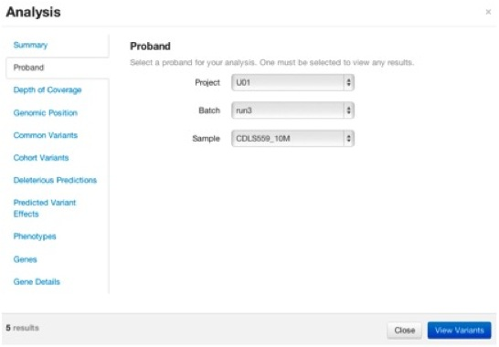

### Guide Workflow

Varify's guided analysis workflow is two phase. The first step is to reduce the number of variants 
down to manageable size by applying filters that remove variants that are predicted to have very 
low or no impact on gene (and thus protein) function. The second step is to extract a slice of 
variants necessary to answer the question at hand.

The following is composed of the variant reduction steps.

<b>Common Variants</b> - compares variants against the 1000 Genomes and Exome Variant Server (EVS) data 
sets and removes the most common variants across the population
<b>Deleterious Predictions</b> - uses the SIFT and PolyPhen2 scores to remove predicted benign 
variants
<b>Altered Gene Function</b> - the effect a variant has on a gene (and downstream) is predicted via 
the SNPEff tool. Synonymous effects can be removed from the set as they have low or no impact on the 
gene function.

At this point, the number of variants should be between 100-1800 variants per sample (for exome 
analysis) depending on the strictness of the filters that were applied. The next phase is to extract 
a slice of variants that are relevant to the analysis. The following additional filters can applied 
to achieve this:

<b>Target Genes</b> - a list of genes can be specified which is appropriate for targeting a disease 
if the genes are known.
<b>Gene Function</b> - if the gene function has been affected in a particular way that is known to 
cause downstream effects, the variants can be reduced based on their effect (this is similar to the 
above reduction filter)
<b>Phenotype/Disease</b> - if a particular phenotype is of interest, the variant set can be reduced 
down to the known phenotype/disease-causing variants

Applying these additional filters should reduce the set down to at most a couple hundred variants. 
This is a reasonable number to wade through for finding novel variants for the samples of interest.

